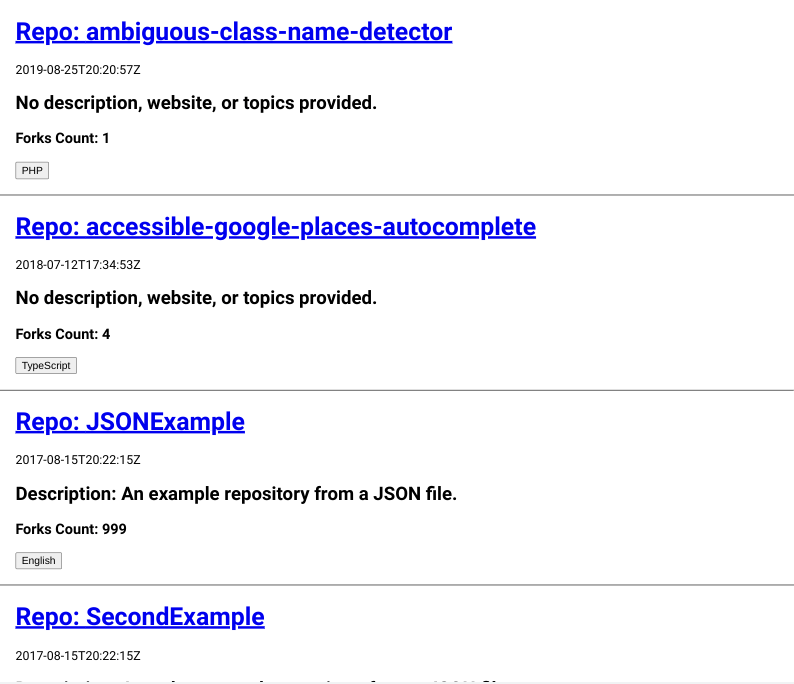
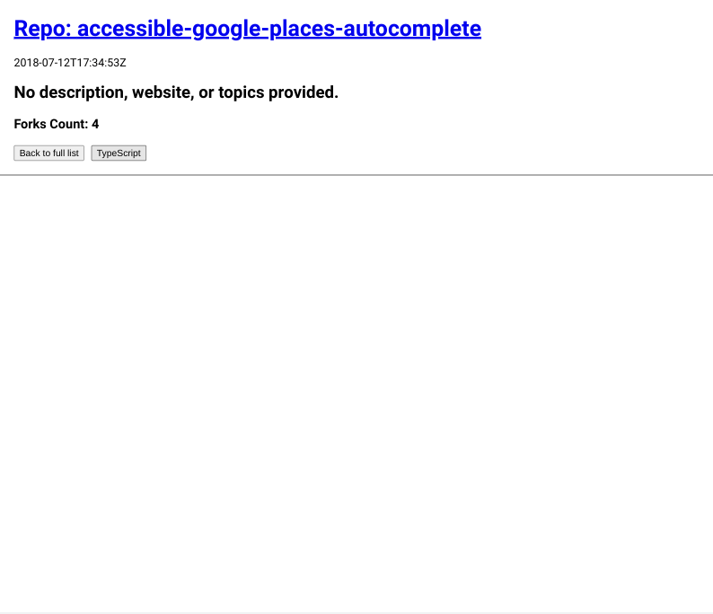
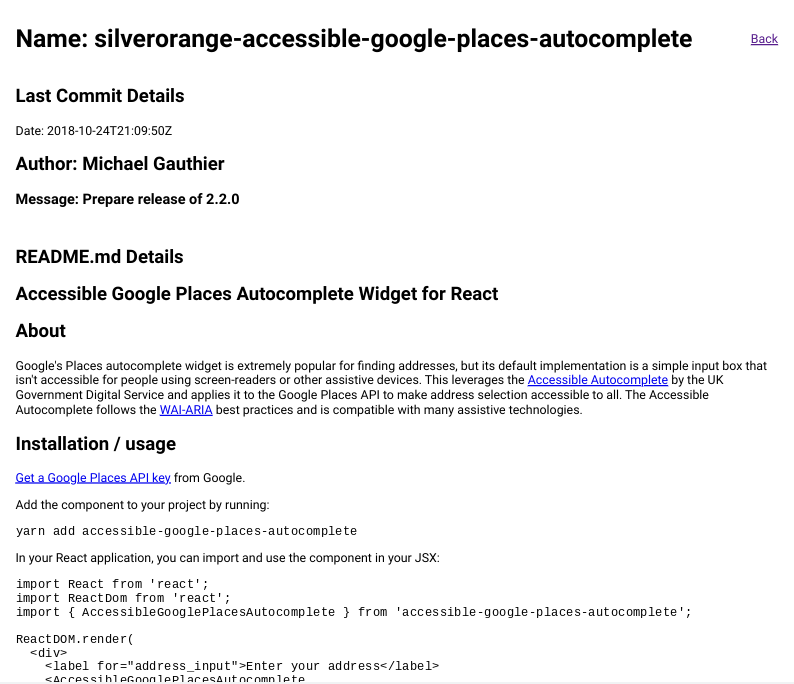
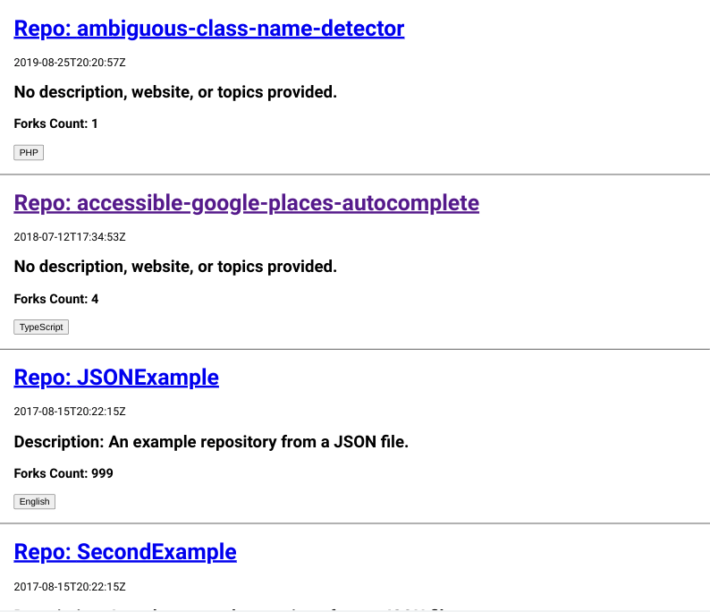

# Exercise Node React Developer

This is a solution to [silverorange Intermediate Developer Assessment](https://github.com/silverorange/exercise-node-react-developer).

## Screenshots



***



***



***



***

## Tasks

### (A) Node/Express

With the provided Express framework in `/api`:

 1. Implement the `/repos` API endpoint
 2. The endpoint should aggregate GitHub repository data from the
following sources:
    - https://api.github.com/users/silverorange/repos
    - The provided JSON file (in `api/data/repos.json`). Assume this file can
      change while the service is running.
 3. Only return repositories where `repository.fork` is `false`.
 4. Return results as JSON-encoded data with a content-type of
    `application/json`.

**Note**: Middleware in `api/src/app.ts` intentionally adds latency and
occasionally returns an error instead of a proper response. You are encouraged
to leave this middleware in place to improve your implementation in (B).

### (B) React

Using the provided React application in `/web`:

 1. Fetch repository data from the Express API created in (A).
 2. Display a list of repositories. Include the repository name, description,
    language, and forks count in the list.
 3. The list of repositories should be displayed in reverse chronological order
    by creation date.
 4. Add buttons for each language type. Make clicking on a language button
    filter the list by language type.
 5. Make each repository in the list clickable.
 6. When you click a repository, display the most recent commit date, author,
    and message.
 6. If the repository has a `README.md` file, it will be located at
    https://raw.githubusercontent.com/${repo.full_name}/master/README.md. In
    this case, also render the Markdown content when clicking on the repository.
 7. Include a way to return to the main list of repositories after you click on
    a repository.

## Environment

You can use any stable version of Node JS. The base project is written using
TypeScript but you may use vanilla JavaScript to complete the tasks.

## Coding Standard

Please use [ESLint](https://eslint.org/) and [Prettier](https://prettier.io/)
for your code. The project is set up to lint your code using:
```sh
npm lint
```

If your editor is not already configured to use Prettier, you can format code
in the project using:
```sh
npm prettier-write
```

## Dependencies

Please use the [Yarn](https://yarnpkg.com/) or
[NPM](https://docs.npmjs.com/cli/npm) tools for dependency
management. You can use any 3rd-party libraries as necessary or as desired in
order to achieve the tasks. The project is currently set up to use Yarn but
you may update it to use NPM if that is your preference.

## Commits

Your commit history is important to us! Try to make meaningful commit messages
that show your progress. Remember to not include your name or any other
self-identifying information in your commit messages.

## Getting Started With the Express Backend (/api)

For this exercise a pre-built Express application is provided. The application
runs by default on `localhost:4000` and has the following endpoints:

 - `http://localhost:4000/repos` - returns a JSON-encoded array of repos. By
   default, an empty array is returned. You will need to add an implementation
   in (A).

### Running the Express Application

```sh
cd api/
npm install
npm start
```

You can verify the API is working by visiting http://localhost:4000/repos in
your browser or another HTTP client. **Please note that about 25% of the time,
the API returns an error message.**

## Getting Started with the React Client (/web)

The React client is a bare Create React App application.

### Running the React Application

```sh
cd web/
npm install
npm start
```

This will open your browser at http://localhost:3000, allowing you to test the
React client.

## Thoughts

- Started working on server first
- No issues after git clone and installing packages - used npm instead of yarn
- Did a fair amount of research before deciding on an approach 
- Axios vs node-fetch - node-fetch is better for typescript support - types are already bundled in
- Axios has better methods
- Could put data/repos.json in a public folder and fetch with axios / node-fetch / native fetch (higher versions of node) vs using file system / importing it directly
- If you use file system, it will only fetch the file at the beginning, if imported - server needs to restart for file to be fetched again - that is why directions include hint 'Assume this file can change while the service is running.'
- You can watch the file with fs.watch however fs.watch is platform dependent
- nodemon?
- Chokidar package could also help
- Better to fetch json file in a function that runs everytime the endpoint is requested
- 'terrible' middleware causes CORS errors in addition to failed requests - moved 'terrible' middleware behind cors middleware 
- A lot of performance considerations in web
- Before upgrading to react router, I had api requests in functions that ran on click and then I toggled state and conditionally rendered the data in the jsx.  
- This created a problem where api request is repeated before setToggle would be updated
- This was clunky but I had just used a similar implementation in [js-dev-test](https://github.com/jdegand/js-dev-test) and this quick implementation allowed me to test the api calls and react-markdown implementation sooner 
- Converting to react router, the function calls are added to a useEffect that runs on load and jsx will show a loading / error state until the requests finish
- Tough to keep previous data from card without sending another api request - have to worry about stale data so maybe you wouldn't want to carry data over anyway
- Put all styles in app.css - at one point, I created a Repos folder to put the Repos.tsx and Repos.css files but ran into linting errors - `components/Repos.tsx was not found.`
- Added models folder in web for various interfaces - kept props interface in the component itself
- Avoided derived state and saved searchTerm to filter the repos list - some jsx duplication with ternary statement to display filtered / non-filtered jsx
- I prefer using fetch with .then() syntax although it is more verbose and you have to remember to check `response.ok`
- Combining fetch and async/await can have pitfalls and not cover all error scenarios - [this article](https://gomakethings.com/error-handing-when-using-the-vanilla-js-fetch-method-with-async-and-await/) shows how convoluted it can get
- Error handling is always a concern when you use fetch.
- I used promise chaining for last commit details - I think that is preferable to async/await unless you have many sequential requests.
- RepoDetail was doing too many things - split markdown fetch & last commit fetch into separate components.
- This made it easier to implement a loading state for each component as well.  
- I had problems with jsx where I could not wrap a Object.keys ternary with additional conditional rendering.  Splitting the components helped with this problem. 
- I thought about using Promise.all, but it seemed to complicate things further and I went with a separate component approach.  
- Not passing props from RepoDetail to Markdown and LastCommit makes testing harder. 
- local data mismatches github response data - local data is missing 50+ fields - either intentional or github api changed
- I am not going to alter the local data file.
- local data mismatch creates problems with typescript - need to either change endpoint response to send 2 arrays - one for github data and another for local data - then combine and sort the data in the repos component vs combining and sorting on the server
- You could fetch commit data / markdown for the local json if silverorange had repos for them.  It seems intentional that those repos don't exist so you are forced to deal with errors.  

## Improvements

- Update to React 18
- Use React Query for fetching or use loaders and new features of React Router or use Axios  
- Converting api requests to async/await implementation 
- Performance improvements
- Tests - need to refactor some components or use msw?
- Semantic HTML and accessibility concerns
- Styling
- Convert timestamps to readable dates - using library or new Date() manipulation
- Better error handling for axios request in api

### Useful Resources

- [React Typescript Cheatsheet](https://react-typescript-cheatsheet.netlify.app/)
- [json2ts](http://json2ts.com/) - easy way to convert response data to typescript interface 
- [Storyblok](https://www.storyblok.com/tp/how-to-send-multiple-requests-using-axios) - how to send multiple requests with axios
- [Log Rocket Blog](https://blog.logrocket.com/using-axios-all-make-concurrent-requests/) - axios concurrent requests
- [Digital Ocean](https://www.digitalocean.com/community/tutorials/how-to-work-with-files-using-the-fs-module-in-node-js) - fs module
- [Node](https://nodejs.dev/en/learn/reading-files-with-nodejs/) - reading files with node
- [Stack Overflow](https://stackoverflow.com/questions/45201027/know-if-the-content-of-a-file-has-been-changed-using-node-js) - how to know if content of a file has been changed
- [Geeks for Geeks](https://www.geeksforgeeks.org/node-js-fs-watch-method/) - fs watch
- [Geeks for Geeks](https://www.geeksforgeeks.org/how-to-monitor-a-file-for-modifications-in-node-js/) - how to monitor a file for modifications
- [Stack Overflow](https://stackoverflow.com/questions/37469178/how-to-refresh-a-page-whenever-my-json-data-file-changes) - refresh page when json data file changes
- [dev2qa](https://www.dev2qa.com/node-js-fs-watch-example/) - fs watch
- [Stack Overflow](https://stackoverflow.com/questions/13695046/watch-a-folder-for-changes-using-node-js-and-print-file-paths-when-they-are-cha) - Chokidar
- [Bobby Hadz](https://bobbyhadz.com/blog/typescript-http-request-axios#making-http-get-requests-with-axios-in-typescript) - http get requests with axios and typescript
- [Stack Overflow](https://stackoverflow.com/questions/61899340/receiving-a-cors-error-when-to-my-react-app-using-fetch-function) - cors error using fetch function
- [Stack Overflow](https://stackoverflow.com/questions/62038298/testing-of-useeffect-hook-with-try-catch) - try and catch and useEffect hook
- [YouTube](https://www.youtube.com/watch?v=ePAZYwgUoA0) - handle fetch error
- [Stack Overflow](https://stackoverflow.com/questions/42928530/how-do-i-load-a-markdown-file-into-a-react-component) - how to load markdown file in a react component
- [Stack Overflow](https://stackoverflow.com/questions/45726013/how-can-i-get-last-commit-from-github-api) - get last commit from github api
- [Bobby Hadz](https://bobbyhadz.com/blog/react-fetch-data-on-button-click) - react fetch data on button click
- [Developer Way](https://www.developerway.com/posts/fetching-in-react-lost-promises) - fetching in react 
- [Stack Overflow](https://stackoverflow.com/questions/9179828/github-api-retrieve-all-commits-for-all-branches-for-a-repo) - (outdated) retrieve all commits from github api
- [Geeks for Geeks](https://www.geeksforgeeks.org/how-to-execute-multiple-promises-sequentially-in-javascript/) - execute multiple promises sequentially in js
- [Blog](https://blog.devgenius.io/implementing-react-router-v6-with-code-splitting-in-a-react-typescript-project-14d98e2cab79) - react router with typescript
- [YouTube](https://www.youtube.com/watch?v=L2kzUg6IzxM) - React Router 6.4
- [Blog](https://ui.dev/react-router-pass-props-to-link) - router pass props to link
- [Stack Overflow](https://stackoverflow.com/questions/43351752/react-router-changes-url-but-not-view) - react router changes url but not view
- [Big Code Nerd](https://bigcodenerd.org/resolving-promises-sequentially-javascript/) - resolving promises sequentially 
- [Stack Overflow](https://stackoverflow.com/questions/70957714/how-can-i-do-async-await-operations-in-sequential-order) - async/await sequentially
- [Blog](https://levelup.gitconnected.com/async-events-in-sequence-with-react-aefd6749d37b) - async/await sequentially
- [Stack Overflow](https://stackoverflow.com/questions/54163952/async-await-in-fetch-how-to-handle-errors) - async/await error handling
- [Dmitri Pavlutin](https://dmitripavlutin.com/javascript-fetch-async-await/) - fetch and async/await
- [Stack Overflow](https://stackoverflow.com/questions/49938266/how-to-return-values-from-async-functions-using-async-await-from-function) - return values from async/await functions
- [GoMakeThings](https://gomakethings.com/error-handing-when-using-the-vanilla-js-fetch-method-with-async-and-await/) - error handling when using fetch in combination with async/await
- [Stack Overflow](https://stackoverflow.com/questions/35604617/react-router-with-optional-path-parameter) - react router with optional path parameter
- [Stack Overflow](https://stackoverflow.com/questions/64729482/typescript-usestate-setstate-in-child-with-argument) - typescript setState
- [Stack Overflow](https://stackoverflow.com/questions/70999713/react-router-v6-access-route-params-and-pass-as-props) - don't pass useParams as prop
- [jest](https://jestjs.io/docs/getting-started#using-typescript) - jest and typescript
- [Stack Overflow](https://stackoverflow.com/questions/70220413/error-usehref-may-be-used-only-in-the-context-of-a-router-component-it-wor) - error usehref may be used only in the context of a router component
- [Blog](https://tomalexhughes.com/blog/testing-components-that-use-react-router-hooks) - testing components that use react router hooks
- [Stack Overflow](https://epicreact.dev/how-to-test-react-use-effect/) - how to test react useEffect